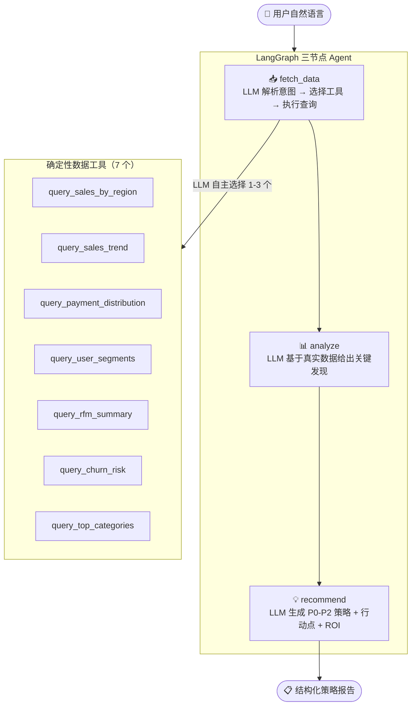

# Olist 电商 AI 运营分析系统

> 基于 **LangGraph + Ollama (Qwen3) + XGBoost** 的 LLM Agent 运营诊断系统。自然语言提问 → Agent 自主查询数据 → 输出带证据诊断 → 生成可确认的运营任务草稿。

---

## 🏗️ 混合 AI 架构

系统采用**三层混合架构**，每层用最合适的技术：

```
用户: "圣保罗州最近销量怎么样？"
         │
┌────────▼──────────────────────────────────┐
│  🧠 LLM 推理层 (Ollama + Qwen3:8b)        │
│  理解问题、选择工具、分析数据、生成策略       │
│  约束：System Prompt 禁止无数据支撑的建议    │
└────────┬──────────────────────────────────┘
         │ 只做推理，不碰原始数据
┌────────▼──────────────────────────────────┐
│  ⚙️ 确定性工具层 (Pandas，6 个工具)         │
│  数据查询 100% 准确，零幻觉                 │
│  地区/趋势/支付/分群/RFM/流失/品类           │
└────────┬──────────────────────────────────┘
         │ 只查数据，不做决策
┌────────▼──────────────────────────────────┐
│  📊 ML 模型层 (KMeans + XGBoost)           │
│  用户分群 + 流失预测，数值可验证             │
└───────────────────────────────────────────┘
```

**设计原则**：LLM 不碰数据，数据不走 LLM。确定性工具打底，LLM 只负责它最擅长的事——理解语言和生成策略。

---

## 🤖 Agent 工作流



**7 类诊断能力**：

| 场景 | 示例问题 |
|------|---------|
| 地区销量 | "圣保罗州最近销量怎么样" |
| 销售趋势 | "分析最近半年的销售趋势" |
| 用户流失 | "客户流失情况如何，怎么挽回" |
| 支付诊断 | "支付方式分布有没有问题" |
| 选品分析 | "哪些产品卖得好" |
| 客户分层 | "客户分群情况怎么样" |

---

## 📁 项目结构

```
olist_project/
├── data/
│   ├── raw/                       # 原始数据（4 个 CSV）
│   └── processed/                 # 清洗后 + 模型产出（10 个 CSV）
│
├── src/
│   ├── crawler.py                 # 爬虫：巴西各州人口
│   ├── data_cleaning.py           # 数据清洗管道
│   ├── analysis_rfm.py            # RFM 客户价值分析
│   ├── analysis_geo.py            # 地理分析（人均销售额）
│   ├── analysis_payment.py        # 支付方式分析
│   ├── model_clustering.py        # KMeans 用户分群
│   ├── model_churn.py             # XGBoost 流失预测
│   ├── visualization.py           # 图表生成（13 张）
│   └── agent/                     # 🤖 Agent 模块
│       ├── tools.py               # 7 个数据查询工具 + TOOL_REGISTRY
│       ├── agent_graph.py         # LangGraph 三节点编排
│       ├── task_store.py          # 本地 JSON / PostgreSQL 任务存储
│       ├── evaluation.py          # A/B 实验与 ROI 评估
│       └── observability.py       # 脱敏运行日志
│       └── run_agent.py           # CLI 入口
│
├── dashboard/
│   ├── dashboard.py               # Streamlit 仪表盘
│   └── ai_operations_system.html  # 静态诊断页面
│
├── web/                           # 静态展示（index.html + CSS/JS）
├── reports/                       # 面试材料
├── output/charts/                 # 13 张自动生成图表
├── PRD.md                         # 产品需求文档
└── requirements.txt
```

**8 个独立模块**，每个可单独运行和测试。原 1000 行的 God Script 已消除。

---

## 📊 核心数据

| 指标 | 数值 |
|------|------|
| 总订单数 | 99,441 |
| 总销售额 | R$ 16,008,872 |
| 总客户数 | 99,441 |
| 平均客单价 | R$ 160.99 |
| RFM 高价值客户 | 3,236 人 |
| 潜在高价值客户 | 21,730 人 |
| Agent 数据工具 | 7 个 |
| 分析图表 | 13 张 |
| 代码模块 | 12 个（8 分析 + 3 Agent + 1 爬虫） |

> 注：XGBoost 流失预测的标签基于 RFM 分数构造（非真实流失标签），用于演示模型流程。生产环境中接入真实流失数据后可直接替换。

---

## 🛠️ 技术栈

| 类别 | 技术 | 说明 |
|------|------|------|
| Agent 编排 | LangGraph | 有向图状态机，三节点工作流 |
| LLM 推理 | Ollama + Qwen3:8b | 本地开源，零 API 成本 |
| 数据处理 | Pandas, NumPy | 10 万级订单 |
| 用户分群 | KMeans (scikit-learn) | 3 类聚类 |
| 流失预测 | XGBoost | 高/中/低风险识别 |
| 可视化 | Matplotlib + Streamlit | 13 图表 + 交互仪表盘 |
| 爬虫 | Requests + BeautifulSoup | 人口数据采集 |
| Web | 静态 HTML + ECharts | 零依赖演示 |

---

## 🚀 快速开始

```bash
# 1. 安装 Ollama 并拉取模型
ollama pull qwen3:8b

# 2. 安装 Python 依赖
pip install -r requirements.txt

# 3. 运行 Agent
python src/agent/run_agent.py "分析最近半年的销售趋势"

# 如需重新生成全部清洗、分析和模型产物
python src/run_pipeline.py
```

**运行独立模块**：

```bash
python src/data_cleaning.py      # 数据清洗
python src/analysis_rfm.py       # RFM 分析
python src/model_churn.py        # 流失预测
python src/visualization.py      # 生成图表
streamlit run dashboard/dashboard.py  # 交互仪表盘
```

### 线上部署能力

应用支持本地 Ollama 和云端 OpenAI 两种模型模式。公开部署时，在 Streamlit Secrets 中配置 `LLM_PROVIDER`、`OPENAI_API_KEY`、`OPENAI_MODEL`，并建议配置 `APP_PASSWORD`、`MAX_AGENT_CALLS_PER_SESSION` 和 PostgreSQL `DATABASE_URL`。访问控制、调用上限、任务持久化和 Agent 运行观测说明见 [DEPLOYMENT.md](DEPLOYMENT.md)。

PostgreSQL 接入后，运营任务会持久化保存；页面侧边栏会显示 `PostgreSQL / 连接正常`，用于演示部署状态。

账号体系支持管理员初始化、邀请码注册、任务归属隔离和按用户保存的历史对话；刷新页面后，可在侧边栏恢复自己的历史分析记录。

每条 Agent 回复均可获得用户反馈；管理员可查看调用量、响应耗时、工具成功率、结构化输出率、满意度、任务采纳率与实验 ROI，用于持续评估 Agent 质量。

负反馈会按“回答内容、数据准确性、页面/交互体验”分流：内容问题可以重新生成，数据和体验问题进入管理员待办中心，形成可追踪的产品改进闭环。

---

## 💼 面试问答

### Q1：你说这是 Agent，和规则引擎有什么区别？

规则引擎是预先写好的 if-else 树——"如果提到圣保罗就调地区查询，如果提到趋势就调趋势查询"。遇到新说法就匹配不上。

我的 Agent 是 **LLM 自主决策**：用户可以用任何自然语言方式提问，LLM 理解意图后自己决定调用哪些工具、怎么组合。6 个工具是插拔式的——新增一个品类分析工具，LLM 自动就会用，不用改任何 if-else。

### Q2：为什么用 LangGraph？

LangChain Chain 是线性的 A→B→C，没有分支。LangGraph 用有向图定义工作流，每个节点是独立决策单元。当前是三节点线性流（fetch→analyze→recommend），但架构天然支持扩展——比如以后加多轮对话，analyze 发现数据不够可以**循环回** fetch_data 再查一次，这在 Chain 里做不到。

### Q3：LLM 产生幻觉怎么办？

三层防护：
1. **数据层不下场**：6 个数据工具是纯 Pandas 查询，不经过 LLM。查出来的数字 100% 准确。
2. **Prompt 硬约束**：System Prompt 明确规定「每条建议必须引用工具返回的真实数据」，不允许自由发挥。
3. **分层隔离**：LLM 出问题不会污染数据层和 ML 层，这两层可独立产出分析报告。

### Q4：XGBoost AUC 0.90+ 是怎么来的？

诚实地说，Olist 数据集没有真实流失标签。我基于 RFM 分数构造了代理标签（rfm_score < 6 视为流失），训练得到 AUC 0.90+。这说明特征有效，但不能等同于真实流失预测准确率。PRD 和代码注释中已说明这一点。接入真实流失数据后训练流程无需改动。

---

## 🔮 扩展方向

- [x] LangGraph 三节点 Agent
- [x] 模块化拆分（8 个独立模块）
- [x] KMeans + XGBoost + RFM 建模
- [x] 结构化策略输出（P0-P2 + 行动点 + ROI）
- [ ] MCP Server 化：将 7 个数据工具包装为 Model Context Protocol 服务
- [ ] RAG 向量库：历史运营报告入库，相似案例检索
- [ ] Web Agent 界面：在现有 `web/` 模板基础上重建聊天 UI
- [ ] 真实流失标签：替换 RFM 代理标签
- [ ] Plotly 迁移：13 张图从 matplotlib 迁到交互式 Plotly

---

## 👤 信息

- 项目类型：数据分析 + LLM Agent 全栈项目
- 技术栈：Python / LangGraph / Ollama / XGBoost / Streamlit
- GitHub：[BobGreen147295/olist_ecommerce_analysis](https://github.com/BobGreen147295/olist_ecommerce_analysis)
