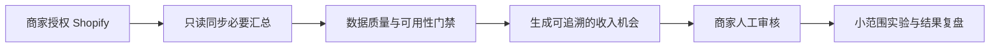

# RevenueOps for Shopify

面向跨境 DTC 商家的只读收入诊断与运营决策工作台。RevenueOps 连接商家授权的数据，识别复购、退款和折扣异常，生成带证据的机会建议；任何客户触达或店铺变更都必须由商家人工确认。

- 在线产品：[olist-revenueops.pages.dev](https://olist-revenueops.pages.dev/)
- 免费试点：[申请 7 天只读诊断](https://olist-revenueops.pages.dev/pilot)
- 当前阶段：首批真实商家试点

> 仓库名和线上域名中的 `olist` 是早期项目留下的兼容标识。当前分支不再分发或在界面展示 Olist 数据集；保留这些地址是为了避免中断 Cloudflare、Render 和 Shopify OAuth 回调。

## 产品流程



## 已实现

- Shopify OAuth：只申请订单、客户、产品和库存的只读权限。
- 聚合同步：订单、客户、产品和库存计数，以及隐私安全的订单趋势。
- 数据隔离：连接状态、导入数据和任务按账户隔离。
- 安全存储：OAuth token 服务端加密，密钥仅通过托管环境变量提供。
- 人工决策门禁：Agent 只能生成建议和活动草案，不能自动触达消费者或修改店铺。
- 试点申请：公开申请页与管理员申请列表。
- 部署：Cloudflare Pages 前端、Render API、托管 PostgreSQL。

## 数据边界

RevenueOps 默认不保存客户邮箱、电话、地址、IP、设备或浏览器信息。订单趋势在同步后压缩为汇总指标；商家可以撤销 Shopify 授权并删除 RevenueOps 中的连接数据。

未连接真实商家时，界面只展示明确标注的**合成演示场景**。合成数据不得与真实 Shopify 汇总混合，也不得作为真实收入承诺。

## 仓库结构

```text
api/        Flask HTTPS API、OAuth 和数据边界
src/agent/  Agent、账户隔离、连接与任务存储
web/        Next.js 商家工作台
tests/      API、权限、Shopify 同步与租户隔离测试
scripts/    数据库迁移与发布辅助脚本
```

## 本地验证

后端：

```bash
python -m pip install -r requirements.txt
python -m pytest -q
python -m flask --app api.app:app run --port 8000
```

前端：

```bash
cd web
npm ci
npm run build
```

浏览器端只配置公开 API 地址：

```text
NEXT_PUBLIC_REVENUEOPS_API_URL=http://localhost:8000
```

所有服务端密钥必须放在托管平台环境变量中。完整配置见 [DEPLOYMENT.md](DEPLOYMENT.md) 和 [api/README.md](api/README.md)。

## 当前验证目标

在首批真实 Shopify 商家中验证三件事：

1. 只读数据连接是否足以发现可信机会；
2. 商家是否愿意审核并执行建议；
3. 小范围实验能否产生可复核的增量结果。

产品不承诺特定营收结果。任何建议都应显示数据来源、统计周期、假设和限制。
